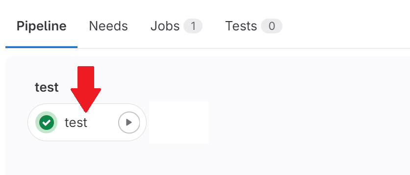

# Инструкция по подключению и использованию вычислительного кластера

## Ссылки на необходимое ПО

[VPN](https://vpn.miet.ru/) - гайд по настройке VPN соединения, которое позволит получить доступ к внутренней сети института, что в свою очередь позволит использовать внутренние ресурсы. В данном случае он необходим для подключения к серверу МИЭТа, если вы пытаетесь зайти не из под сети МИЭТ.<br>

[TigerVNC Viewer](https://sourceforge.net/projects/tigervnc/files/stable/1.13.1/tigervnc64-1.13.1.exe/download) - программа для установки VNC подключения, которое позволит получить удаленный доступ к серверу через сеть. Программа предоставляет возможность удаленного доступа к рабочему столу с использованием протокола VNC. Пользователь может подключаться к удаленному рабочему столу и управлять им, будто находится перед ним.

## Установка VPN соединения

> Подключение к VPN необходимо, если вы решили поработать из дома или раздали себе интернет с мобильного телефона, работая в МИЭТ

1. Запустите OpenVPN и подключитесь к сети МИЭТ


2. Откроются окна: журнал событий и окно для ввода логина и пароля


Если вы являетесь студентом МИЭТ, то введите свой логин-пароль от внутренних сервисов МИЭТ (ОРИОКС и так далее).

Если вы являетесь гостем, то вам необходимо ввести "Логин МИЭТ" и "Пароль МИЭТ" с листа, который вам выдали организаторы хакатона. Пример такого листа показан на рисунке ниже.


3. При успешном подключении вы увидите следующее сообщение


> Обратите внимание, что с одной учетной записи VPN возможно только одно подключение одновременно. Если попытаться подключиться к VPN с двух устройств одновременно, то они будут "выбивать" друг друга из сети


## Установка VNC соединения

1. Запустите TigerVNC. Появится окно с вводом IP адреса и порта. Введите адрес `82.179.178.13`. Порт VNC (4 цифры, например, 6112) указан в листе бумаги с паролями


2. Появится окно с вводом пароля. Введите "Пароль Сервер" с листа бумаги с паролями


3. При успешном подключении вы увидите рабочий стол удаленного сервера


## Скачивание исходного материала

1. Перейдите на [страницу Gitlab](https://gitlab.soc-design-challenge.ru/) Хакатона. Сделать это можно воспользовавшись браузером Firefox на удаленном сервере (открыть его можно кликнув на иконку земного шара с курсором снизу экрана) или любым другим браузером на компьютере. Введите "Логин Сервер" и "Пароль Сервер" с листа бумаги


2. При успешном входе вы увидите список доступных вам репозиториев:
   - `cicd` - репозиторий с конфигурацией CI, который проводит автоматическое тестирование **(взаимодействие с ним не предусмотрено)**
   - `hack24` - рабочий репозиторий вашей команды
   - `verif2024` - репозиторий с исходными данными


3. Для работы вам необходимо склонировать репозитории `hack24` и `verif2024` в любое доступное место на удаленном сервере

Для этого скопируйте ssh ссылку на клонирование репозитория:

 

Затем откройте терминал в папке, куда хотите склонировать репозиторий:

 

Введите команду `git clone *copied_ssh_link*`:


При возникновении в терминале необходимости подтверждения введите `yes`.

4. Во избежание дальнейших проблем при работе с git задайте значения для email и name с помощью команд:
```
git config --global user.email "you@example.com"
git config --global user.name "Your Name"
```
Двойные кавычки обязательны для обрамления ваших значений.

Введенные значения ни на что не повлияют, но будет удобнее, если вы введете валидные значения одного из членов команды.


## Подготовка файлов к работе

1. Перейдите в терминале в папку репозитория hack24 (команда [cd](https://losst.pro/komanda-cd-linux)). Создайте там ветку командой `git checkout -b *your_branch_name*` (в самой команде звездочками обрамлять название ветки не нужно)

2. Скопируйте содержимое папки репозитория `verif2024` в папку репозитория `hack24`

3. В папке `dut_protected` есть 5 номерных директорий. В них содержатся зашифрованные RTL дизайны **с различными ошибками**. Используя их, вы можете локально отлаживать разработанные вами scoreboard и тесты. Сейчас выберете любую номерную директорию и перейдите в нее. Скопируйте из нее папку `dut` в папку hack24 (на один уровень с директориями `dut_protected` и `tb`).

4. В итоге папка вашего репозитория `hack24` должна выглядеть следующим образом:


## Запуск симуляции

1. В терминале необходимо создать и экспортировать переменную `GIT_HOME`, которая должна содержать путь до hack24

Используйте в терминале команду `export GIT_HOME=/home/*login*/*path_to_hack24*`.

2. Создайте в любом доступном месте папку, в которой будут храниться результаты локальных запусков симуляции, и перейдите в нее в терминале
   
3. Загрузите программный модуль Xcelium командой `module load cadence/XCELIUMMAIN/19.03.009`
   
4. Запустите локальную симуляцию, вызвав работу скрипта `run.sh` из рабочей папки. Не забудьте предварительно задать нужный параметр `testname` в скрипте
   
Команда для запуска скрипта `run.sh`:
```
$GIT_HOME/run.sh
```

1. Откроется графический интерфейс Simvision (Design Browser и Console). Инструкцию по работе с ним можно найти [здесь](./methodics_and_guides.md#отладка-gui).


## Тестирование разработанного функционала на кластере

1. После локальной отладки разработанного функционала scoreboard и тестов необходимо сделать коммит изменений

> Не забудьте предварительно перечислить все разработанные тесты в файле `tests.lst`

Используйте команду `git add -A` для добавления всех новых/измененных файлов проекта в список к следующему коммиту.

Затем используйте команду `git commit -m "Your comment to commit"` для выполнения коммита. В кавычках измените текст на собственный комментарий к коммиту.

2. Загрузите выполненный коммит на сервер, используя команду `git push origin *your_branch_name*`. Используйте название своей ветки вместо \*your_branch_name\* (в самой команде звездочками обрамлять название ветки не нужно).

После выгрузки на сервер ветки с коммитом вы увидите ее в списке веток репозитория на Gitlab:


Перейдите на загруженную только что ветку.

1. В верхней части страницы находится небольшая информационная иконка о состоянии прохождения симуляции на наборе дизайнов. Нажмите на эту иконку


4. Запустите проверку, нажав на треугольник значок


5. Откройте запустившуюся проверку, кликнув на нее



6. Здесь находится журнал работы скрипта CI. Дождитесь завершения работы CI и внимательно ознакомьтесь с журналом, там будут выводиться обнаруженные вашим тестбенчом ошибки в проверяемых дизайнах


7. Чтобы посмотреть полученные в ходе тестирования временные диаграммы, откройте журнал **в браузере Firefox на удаленном сервере** и нажмите кнопку `Download` справа (выделена на рисунке сверху красным)

8. В директорию `Загрузки` скачается архив, который лучше перенести в другое место, путь до которого не содержит русских символов. Далее перейдите в терминале в папку, где лежит архив, и введите команду `unzip *archive_name*` для разархивации

9. Откройте Simvision, используя команду `simvision`

Дальнейшие шаги повторяют материал из [гайда](./methodics_and_guides.md#отладка-gui)

10. Нажмите File, а затем Open Database (или сочетание клавиш Ctrl + O)

11. Зайдите в папку, полученную из архива. Затем в папку `results` и в номерную папку `dut`. Выберите файл формата `.shm`, нажмите Open. Закройте окно `Open Database`

12. В Design Browser (слева) раскройте выпадающий список до env_if включительно. Выберите все интерфейсы и кликните `Send to Waveform Window`. Таким образом вы можете смотреть временные диаграммы


