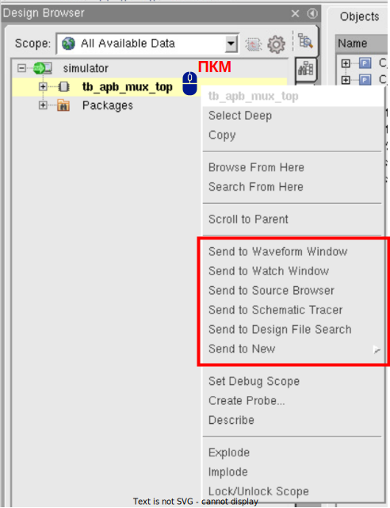
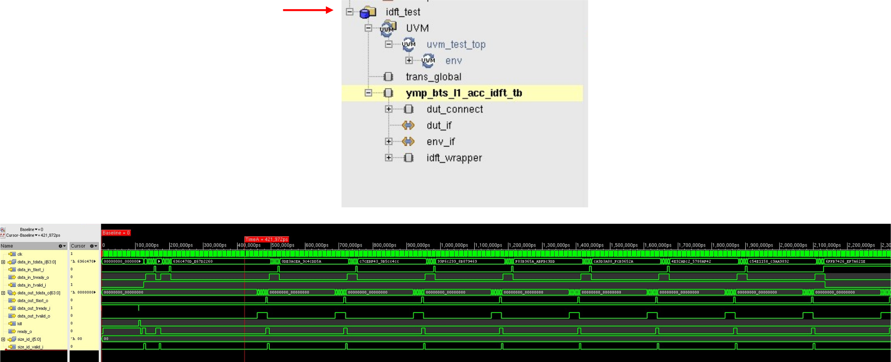

# Методические материалы
## Лекции Школы Синтеза по верификации
* [Маршрут проектирования и типы верификации цифровых устройств. Введение в функциональную верификацию. Выполнение и разбор простейших примеров.](https://www.youtube.com/watch?v=d5VjAqGpBvI)
* [Функциональная верификация и базовая генерация случайных воздействий. Взаимодействие с устройствами с синхронной логикой.](https://www.youtube.com/watch?v=9lZ_fpcos6g)
* [Функциональная верификация и создание тестовых сценариев. Взаимодействие с тестируемым устройством при помощи протоколов.](https://www.youtube.com/watch?v=JXlIlIFPgxY)
* [Введение в функциональную верификацию на основе транзакций. Применение ООП для верификации цифровых устройств. Рандомизация транзакций.](https://www.youtube.com/watch?v=HRqS_vmi45w)
* [Типовая структура верификационного окружения с применением ООП. Роли и взаимодействие компонентов. Step-by-step проектирование и применение.](https://www.youtube.com/watch?v=6WqGzAssEIU)
* [Законченное верификационное окружение (Verification Intellectual Property). Основные свойства и составные части. Step-by-step проектирование и отладка.](https://www.youtube.com/watch?v=a_TJUXc3ifM)

## Полезные ресурсы
* [ChipVerify: Verification](https://www.chipverify.com/)
* [VLSI Verify](https://vlsiverify.com/systemverilog/)

## Теоретическая справка

#### 1. Основные правила суммирования матриц:

* Суммировать можно только матрицы одинакового размера, то есть матрицы с одинаковым количеством строк и столбцов.
  
* Сумма матриц проводится путем сложения элементов с одинаковыми индексами (элементы с одинаковыми позициями).

<p align="center">
    
</p>

#### 2. Основные правила умножения матриц:

* При умножении матрицы переставлять нельзя.

* Умножение матриц возможно, если количество столбцов левой матрицы равно количеству строк правой матрицы.

* Результирующая  матрица $`C_{M\times Q}=A_{M\times N}\times B_{N\times Q}`$ будет иметь размерность $`M\times Q`$, где $`M`$ - количество строк левой матрицы, $`Q`$ - количество столбцов правой матрицы.

<p align="center">
    
</p>

#### 3. Основные правила умножения матрицы на коэффициент:

* Каждый элемент матрицы умножается на это число.

* Результат будет матрица того же размера, что и исходная матрица.

* Элемент $`b_{ij}`$ матрицы после умножения на число $`k`$ будет равен $`k\cdot b_{ij}`$.

<p align="center">
    
</p>

#### 4. Основные правила транспонирования матриц:

* При транспонировании строки матрицы становятся столбцами, а столбцы - строками.

* Размеры матрицы меняются при транспонировании. Матрица $`A`$ размера $`M\times N`$ становится транспонированной матрицей $`A^T`$ размера $`N\times M`$.

* Транспонировать можно матрицу любого размера.

<p align="center">
    
</p>

#### 5. Основные правила вычисления определителя матрицы:

* Вычислить определитель можно только для квадратных матриц (т.е., количество строк равно количеству столбцов).

* Для матрицы размером $`N\times N`$ определитель существует и является корректным, когда матрица является невырожденной, т.е., ее определитель не равен нулю.

#### 6. Основные правила вычисления обратной матрицы:

* Только квадратные матрицы (т.е., количество строк равно количеству столбцов) имеют обратные матрицы.

* Для существования обратной матрицы определитель исходной матрицы не должен быть равен нулю. Проверка на невырожденность матрицы обычно осуществляется путем вычисления определителя.

<p align="center">
    
</p>

где $`C^*`$ – присоединенная матрица, составленная из алгебраических дополнений для соответствующих элементов транспонированной матрицы, $`\det A`$ – определитель исходной матрицы.

<p align="center">
    
</p>

1. Разложить определитель исходной матрицы, например по первой строке ($`i = 1`$):

<p align="center">
    
</p>

где $`A_{ij}`$ – алгебраическое дополнение элемента $`a_{ij}`$.

<p align="center">
    
</p>

где $`М_{ij}`$ – минор элемента $`a_{ij}`$.

<p align="center">
    
</p>

<p align="center">
    
</p>

Определитель не равен 0, значит обратная матрица существует.

2. Найти алгебраические дополнения:

<p align="center">
    
</p>

3. Построить присоединенную матрицу (с учетом транспонирования):

<p align="center">
    
</p>

4. Вычислить обратную матрицу:

<p align="center">
    
</p>

#### Ссылки на полезные источники:
* [Сложение, умножение на коэффициент, перемножение и транспонирование матриц](http://mathprofi.ru/deistviya_s_matricami.html)
* [Как вычислить определитель матрицы методом дополнительных миноров](http://mathprofi.ru/kak_vychislit_opredelitel.html)
* [Как найти обратную матрицу методом алгебраических дополнений](http://mathprofi.ru/kak_naiti_obratnuyu_matricu.html)

## Навигация по проекту
```
./hack-2024/
    ./dut/                                     – исходный код проверяемого RTL
        ./ymp_alu_matrix_top.sv
        ./ymp_alu_regs.sv
        ./ymp_alu_control_unit.sv
    ./tb/                                      – исходный код тестового окружения
        ./apb_master_vc/                           – верификационный компонент APB подобного протокола
            ./apb_master_agent.sv                      – ведущий агент APB подобного протокола
            ./apb_master_agent_if.sv                   – интерфейс APB подобного протокола
            ./apb_master_driver.sv                     – драйвер APB подобного протокола
            ./apb_master_monitor.sv                    – монитор APB подобного протокола
            ./apb_master_transaction.sv                – класс транзакции агента APB подобного протокола
        ./axis_vc/                                 – верификационный компонент AXI-stream подобного протокола
            ./axis_master_vc/                          – ведущий верификационный компонент AXI-stream подобного протокола
                ./axi_stream_master_agent.sv               – ведущий агент AXI-stream подобного протокола
                ./axi_stream_master_driver.sv              – драйвер ведущего агента AXI-stream подобного протокола
            ./axis_slave_vc/                           – ведомый верификационный компонент AXI-stream подобного протокола
                ./axi_stream_slave_agent.sv                – ведомый агент AXI-stream подобного протокола
                ./axi_stream_slave_driver.sv               – драйвер ведомого агента AXI-stream подобного протокола
            ./axi_stream_agent_if.sv                   – интерфейс AXI-stream подобного протокола
            ./axi_stream_monitor.sv                    – монитор AXI-stream подобного протокола
            ./axi_stream_transaction.sv                – класс транзакции AXI-stream подобного протокола
        ./irq_vc/                                  – верификационный компонент прерывания
            ./irq_agent.sv                             – класс агента прерывания
            ./irq_agent_if.sv                          – интерфейс прерывания  
            ./irq_monitor.sv                           – монитор преывания
            ./irq_transaction.sv                       – класс транзакции прерывания
        ./clk_vc/                                  – верификационный компонент тактирования
            ./clk_agent.sv                             – агент тактирования
            ./clk_agent_if.sv                          – интерфейс тактирования
            ./clk_driver.sv                            – драйвер тактирования
            ./clk_transaction.sv                       – класс транзакции тактирования
        ./rst_vc/                                  – верификационный компонент сброса
            ./rst_agent.sv                             – класс агента сброса
            ./rst_agent_if.sv                          – интерфейс сброса  
            ./rst_driver.sv                            – драйвер сброса
            ./rst_monitor.sv                           – монитор сброса
            ./rst_transaction.sv                       – класс транзакции сброса
        ./alu_matrix_defines.sv                    – некоторые константные размерности
        ./alu_matrix_env.sv                        – класс окружения, содержит агенты
        ./alu_matrix_env_if.sv                     – интерфейс между тестовым окружением и DUT'ом
        ./alu_matrix_pkg.sv                        – содержит определения типов (может быть дополнен)
        ./alu_matrix_reg_model.sv                  – класс регистровой модели
        ./alu_matrix_scoreboard.sv                 – класс проверки результатов, должен содержать модель проверяемого дизайна
        ./alu_matrix_tb_top.sv                     – модуль верхнего уровня, здесь подключается DUT и создается тест
        ./alu_matrix_test.sv                       – класс сценария тестирования
    ./run.sh                                       - скрипт для запуска локальной симуляции
    ./tb_files.lst                                 - список файлов-исходников
    ./tests.lst                                    - список тестов, запускаемых при тестировании на CI 
```

# Запуск
### Предварительно загрузить XCELIUM:
(Вставить текст в терминал на колесико мыши)
```
module load cadence/XCELIUMMAIN/19.03.009
```

Убедитесь, что создали и экспортировали переменную GIT_HOME:

```
export GIT_HOME=/home/*login*/*path_to_hack24*
```

### Команда для запуска:

```
$GIT_HOME/run.sh
```

В самом скрипте `run.sh` есть параметр ```<testname>```, указывающий какой тест выполнить. Не забывайте его менять при необходимости.

Для отображения в логе информации о всех проходящих через драйверы и мониторы транзакций можно добавить в скрипт параметр ```+TRAN_INFO```.

# Отладка
**Имеет смысл смотреть на первое сообщение об ошибке (\*E или \*F) в логе.** \
Сообщение об ошибке имеет следующую структуру:


Некоторые типовые ошибки:
* Отсутствие точки с запятой в конце строки:
```
    join_none
            |
xmvlog: *E,EXPSMC (./../hack-2024/tb/apb_master_vc/apb_master_agent.sv,31|12): expecting a semicolon (';') [10.2.2][10.2(IEEE)].

```
* Тоже отсутсвие точки с запятой в конце строки, но после объявления задачи/функции: ```task task_name();```
```
    fork
       |
xmvlog: *E,EXPKWS (./../hack-2024/tb/apb_master_vc/apb_master_agent.sv,28|7): Expecting port direction keyword 'input', 'output', 'inout', or 'ref'.
```
* Тип использован до объявления (скорее всего пропущен соответствующий `include "file.sv"):
```
  apb_master_driver  driver;
                  |
xmvlog: *E,NOIPRT (./../hack-2024/tb/apb_master_vc/apb_master_agent.sv,11|18): Unrecognized declaration 'apb_master_driver' could be an unsupported keyword, a spelling mistake or missing instance port list '()' [SystemVerilog].
```
* Отстутсвует ``` `endif``` в конце файла после соответствующего ``` `ifndef```, защищающие содержимое от повторного включения:
```
`endif // !ALU_MATRIX_TB_TOP
                            |
xmvlog: *E,EOFICD (./../hack-2024/tb/alu_matrix_tb_top.sv,68|28): EOF found within `ifdef (@ ./tb/alu_matrix_tb_top.sv,1|6) compiler directive [16.4(IEEE)].
```
* Классу был передан статический интерфейс, а не ссылка (virtual): ```function new(virtual apb_master_agent_if apb_if, mailbox mon_outside);```
```
  function new(apb_master_agent_if apb_if, mailbox mon_outside);
                                 |
xmvlog: *E,SVNOTY (./../hack-2024/tb/apb_master_vc/apb_master_agent.sv,16|33): Syntactically this identifier appears to begin a datatype but it does not refer to a visible datatype in the current scope.
```
* Обращение по пустой ссылке (экземпляр класса объявлен, но не создан): ```example_name = new;```
```
xmsim: *E,TRNULLID: NULL pointer dereference.
          File: ./tb/apb_master_vc/apb_master_agent.sv, line = 29, pos = 12
         Scope: worklib.$unit_0x3d959e2d::apb_master_agent::main
          Time: 0 FS + 0
```

* Экземпляр класса объявлен не в начале begin-end блока:

Неправильно:
```SystemVerilog
          forever begin
            some_code_before();
            axi_stream_transaction transaction;
            transaction = new();
            ...
```
Правильно:
```SystemVerilog
          forever begin
            axi_stream_transaction transaction;
            transaction = new();
            some_code_after();
            ...
```
Сообщение об ошибке:
```
            axi_stream_transaction transaction;
                                             |
xmvlog: *E,MISEXX (./../hack-2024/tb/axis_vc/axi_stream_monitor.sv,44|45): expecting an '=' or '<=' sign in an assignment [9.2(IEEE)].
```

# Отладка (GUI)

Справка:
```
module load cadence/XCELIUMMAIN/19.03.009;
cdnshelp
```
### Основные функциональные окна:


* Design Browser – отображает иерархию проекта;
* Waveform Window – отображает выбранные сигналы в виде временных диаграмм;
* Console – отображает логи и ошибки симуляции, также как в терминале;
* Source Browser – отображает исходный код, а также значения переменных в процессе симуляции,
* Expression Calculator – позволяет добавлять сигналы, соответсвующие некоторому выражению.

#### Кнопки вызова окон:


#### Или через Design Browser:



### Работа с Waveform Window:


### Работа с базой данных
1. Создание дампа:


2. Сохранение:


3. Загрузка:


4. Результат (временная диаграмма сохранена, не требуется повторное симулирование):



### Точки останова (Breakpoints)


Точка останова по временному интервалу, изменению сигнала, выполнению определенной строки, условная точка останова.
### Выражения (Expressions)
1. Создание (выбрать нужные сигналы):


2. Описать выражение:


3. Результат (добавлен сигнал результата выражения):


### Сравнение (Comparison)
1. Создание (выбрать сигналы для сравнения):


2. Результат (отмечены области, в которых сигналы не равны):

