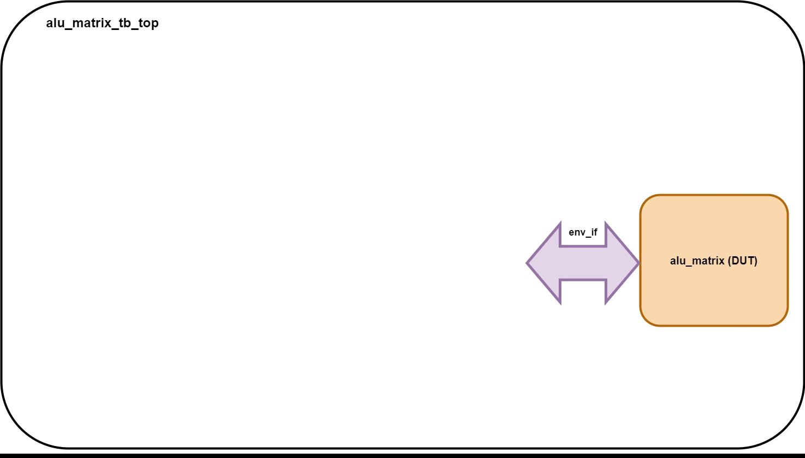
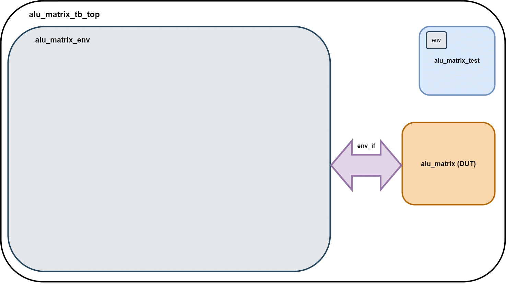

# Описание тестового окружения (Testbench description)

## Оглавление

- [Оглавление](#оглавление)
  - [Назначение документа](#назначение-документа)
  - [Справка](#справка)
    - [1. Очень важно - про запрещенные к редактированию части тестового окружения](#1-код-тестового-окружения-содержит-фрагменты-редактирование-которых-недопустимо-такие-фрагменты-обрамлены-специальными-многострочными-комментариями-начинающихся-со-слов-do-not-touch-code-изменение-кода-внутри-таких-фрагментов-может-привести-к-дисквалификации-команды)
    - [2. Тестовое окружение VS класс окружения](#2-не-стоит-путать-понятие-тестового-окружения-testbench-тестбенч-с-объектом-класса-окружения-environment-окружение-в-составе-тестбенча)
    - [3. Agent, driver, monitor, scoreboard](#3-для-дальнейшего-понимания-происходящего-необходимо-быть-знакомым-с-такими-общепринятыми-сущностями-в-составе-окружения-как-agent-агент-driver-драйвер-monitor-монитор-и-scoreboard-скорборд-иногда-также-называют-таблицей-результатов)
    - [4. Переменная класса VS дескриптор VS объект класса](#4-не-стоит-путать-понятие-переменной-класса-class-variable-дескриптора-handle-и-объекта-класса-object)
    - [5. Mailbox, interface, queue](#5-для-дальнейшего-понимания-происходящего-необходимо-быть-знакомым-с-такими-сущностями-языка-systemverilog-как-mailbox-и-interface-а-также-со-структурой-данных-queue)
  - [Структурная схема тестового окружения](#структурная-схема-тестового-окружения)
  - [Краткое описание компонентов тестового окружения](#краткое-описание-компонентов-тестового-окружения)
  - [Параметры конфигурации тестового окружения](#параметры-конфигурации-тестового-окружения)
  - [Механизмы взаимодействия между компонентами тестового окружения](#механизмы-взаимодействия-между-компонентами-тестового-окружения)
  - [Механизмы взаимодействия между разработчиком тестов и компонентами тестового окружения](#механизмы-взаимодействия-между-разработчиком-тестов-и-компонентами-тестового-окружения)

## Назначение документа

Документ описывает тестовое окружение для блока АЛУ для операций над матрицами (ALU_MATRIX).

---

## Справка

```diff
- ВАЖНАЯ ДЛЯ ПОНИМАНИЯ ИНФОРМАЦИЯ -
```
### 1. Код тестового окружения содержит фрагменты, редактирование которых ```НЕДОПУСТИМО```. Такие фрагменты обрамлены специальными многострочными комментариями, содержащими слова ```DO NOT TOUCH CODE```. Изменение кода внутри таких фрагментов может привести к **дисквалификации команды**.

### 2. Не стоит путать понятие *тестового окружения* (testbench, тестбенч) с *объектом класса окружения* (environment, окружение) в составе тестбенча.

**Тестбенч** - это вся структура целиком, виртуальный отладочный стенд, содержащий в себе окружение, проверяемый дизайн (**DUT - Design Under Test**) и др.

**Окружение** - это часть тестбенча, содержащая в себе сущности (агенты, скорборд и др.), осуществляющие функции генерации, отправки, получения, проверки результатов тестирующих воздействий.

### 3. Для дальнейшего понимания происходящего необходимо быть знакомым с такими общепринятыми сущностями в составе окружения как **agent** (агент), **driver** (драйвер), **monitor** (монитор) и **scoreboard** (скорборд, иногда также называют *таблицей результатов*).

**Агент** — это компонент, который группирует все верификационные подкомпоненты, взаимодействующие с конкретным интерфейсом верифицируемого устройства.

С точки зрения верифицируемого устройства, агент — это устройство, которое подключено по ту сторону интерфейса.

При этом сам по себе агент не обязан представлять собой какую-то специфичную реализацию конкретного устройства. Он может просто осуществлять обмен данными по стандартному интерфейсу в соответствии с его спецификацией, в то время как особенности конкретного устройства будут выражены в сценариях и таблицах результатов (scoreboards).

**Монитор** представляет собой компонент, реализующий анализатор трафика определенного интерфейса. Он отслеживает транзакции, которые были переданы через интерфейс чтобы затем, передать их верификационному окружению (в скорборд и контроллер функционального покрытия при его наличии).
Монитор никак не влияет на работу интерфейса и является пассивным наблюдателем.

**Драйвер**, в противоположность монитору, активно взаимодействует с интерфейсом и осуществляет полный контроль над входными сигналами верифицируемого устройства. Драйвер является компонентном, реализующим протокол осуществления транзакций на выбранном интерфейсе, поэтому драйвер APB шины, например, управляет сигналами только APB интерфейса и не может манипулировать сигналами тактирования или сброса. Драйвер не определяет что будет передано по данному интерфейсу (содержимое транзакций), он только определяет то как именно должны себя вести входные сигналы верифицируемого устройства, чтобы данная транзакция была передана.

**Скорборд** служит для проверки корректности работы тестируемого дизайна.
В большинстве случаев scoreboard собирает транзакции со всех мониторов окружения и использует их для совершения проверок.
Проверки могут быть различными и зависят от функционала конкретного устройства, которое всегда указано в спецификации к тестируемому дизайну.


### 4. Не стоит путать понятие *переменной класса* (class variable), *дескриптора* (handle) и *объекта класса* (object).

**Объект класса** - это экземпляр класса, который создается при вызове его функции-конструктора - `new()`. В SystemVerilog все объекты класса создаются динамически; в момент времени 0 или после него. В стандарте SystemVerilog не указано, как и когда объект может быть уничтожен - только когда он НЕ может быть уничтожен.

**Переменная класса** - это переменная, значение которой представляет ссылку на объект класса. Как и у любой другой переменной, время жизни переменной класса зависит от того, как и где она определена (статически, автоматически или динамически).

Значение, представляющее ссылку на объект класса, называется **дескриптором**. Вы никогда не сможете увидеть или представить буквальное значение дескриптора (за исключением специального дескриптора `null`, который означает отсутствие ссылки на какой-либо объект). Вы должны использовать переменную класса в любом выражении для ссылки на члены или методы объекта класса, используя дескриптор класса, хранящийся в переменной.

Информацию с примерами кода также можно найти [здесь](https://www.chipverify.com/systemverilog/systemverilog-class-handle-object).

### 5. Для дальнейшего понимания происходящего необходимо быть знакомым с такими сущностями языка SystemVerilog как [mailbox](https://www.chipverify.com/systemverilog/systemverilog-mailbox) и [interface](https://www.chipverify.com/systemverilog/systemverilog-interface), а также со структурой данных [queue](https://www.chipverify.com/systemverilog/systemverilog-queue).

---


## Структурная схема тестового окружения

Ознакомиться с файловой иерархией для лучшей навигации по проекту можно [здесь](./methodics_and_guides.md#навигация-по-проекту)


## Краткое описание компонентов тестового окружения

| Название                | Описание                                                                                                                                                         |
| ----------------------- | ---------------------------------------------------------------------------------------------------------------------------------------------------------------- |
| `alu_matrix_tb_top`     | Верхний уровень тестбенча. Содержит в себе объект класса окружения (`alu_matrix_env`), DUT, тест и обеспечивает связь между ними: DUT и окружение - через интерфейс `env_if`, который содержит в себе интерфейсы всех агентов; окружение и тест - через дескриптор объекта класса окружения `env`                                                                                  |
| `alu_matrix_test`       | Описание подаваемых в DUT входных стимулов, заключающееся в последовательном создании транзакции, ее заполнении и передачи в соответствующий mailbox             |
| `alu_matrix (DUT)`      | Проверяемый дизайн. Подключается к окружению через интерфейс `env_if`                                                                                            |
| `env_if`                | Интерфейс окружения. Связующий элемент между DUT и окружением. Содержит в себе интерфейсы всех агентов                                                           |
| `alu_matrix_env`        | Класс окружения. Содержит в себе все остальные верификационные компоненты и обеспечивает связь между ними                                                        |
| `clk_agent`             | Отвечает за генерацию тактового сигнала, который далее подается в DUT и во все остальные верификационные компоненты (кроме `clk_vc`, `rst_vc` и `irq_vc`)        |
| `rst_agent`             | Отвечает за генерацию сигнала сброса, который далее подается в DUT и во все остальные верификационные компоненты (кроме `clk_vc`, `rst_vc` и `irq_vc`)           |
| `irq_agent`             | Отвечает за мониторинг сигнала прерывания, передавая наблюдаемые изменения в Scoreboard                                                                          |
| `axis_master_agent`     | Отвечает за передачу транзакций через AXI-stream подобный интерфейс `axis_in_if` в DUT, а также мониторит шину, передавая наблюдаемые транзакции в `Scoreboard`  |
| `axis_slave_agent`      | Отвечает за передачу транзакций через AXI-stream подобный интерфейс `axis_out_if` в DUT, а также мониторит шину, передавая наблюдаемые транзакции в `Scoreboard` |
| `apb_master_agent`      | Отвечает за передачу транзакций через APB подобный интерфейс `apb_if` в DUT, а также мониторит шину, передавая наблюдаемые транзакции в `Scoreboard`             |
| `alu_matrix_reg_model`  | Регистровая модель, отражающая в себе состояние эталонной модели в процессе работы. Содержит в себе регистры, указанные в спецификации АЛУ                       |
| `Scoreboard`            | Служит для проверки функциональных характеристик блока                                                                                                           |


## Параметры конфигурации тестового окружения

| Название     | Значение по умолчанию | Описание                                                   |
| ------------ | --------------------- | ---------------------------------------------------------- |
| AXI_DATA_W   | 8                     | Разрядность шины данных AXI                                |
| APB_ADDR_W   | 32                    | Ширина адреса AXI шины                                     |
| APB_DATA_W   | 32                    | Ширина данных AXI шины                                     |
| BUFFER_DEPTH | 64                    | Размер буфера (в количестве элементов) для хранения матриц |

```diff
- МЕНЯТЬ УСТАНОВЛЕННЫЕ ЗНАЧЕНИЯ ЗАПРЕЩЕНО, ОНИ УКАЗАНЫ ИСКЛЮЧИТЕЛЬНО ДЛЯ ОЗНАКОМЛЕНИЯ -
```

Перечисленные в таблице параметры находятся в файле *`alu_matrix_defines.sv`*.


## Механизмы взаимодействия между компонентами тестового окружения

На самом верхнем уровне тестбенча расположены три сущности: тест, DUT и окружение.

Связь между тестом и окружением осуществляется с помощью дескриптора, содержащегося в переменной класса окружения внутри теста.

При запуске симуляции на самом верхнем уровне тестбенча сначала создается объект окружения (через вызов функции `new()`) и дескриптор созданного объекта присваивается переменной `env`:

```SystemVerilog
// Creating environment
env = new(env_if);
```

Затем эта переменная передается в тест:

```SystemVerilog
// Creating test
test = new(env);
```

где уже локальной переменной `env` присваивается дескриптор на тот же самый объект окружения:

```SystemVerilog
function new(alu_matrix_env env);
  this.env = env;
endfunction
```

В результате у нас есть возможность манипулировать окружением `env` и его внутренними сущностями из теста.



Подобное "копирование" дескриптора регулярно происходит при построении окружения. Каждый раз при создании того или иного компонента через функцию `new()` с передачей в нее переменной того или иного объекта дескриптор этого объекта присваивается локальной переменной. Таким образом обеспечивается связь между компонентами в окружении.

---

DUT и окружение связаны друг с другом через интерфейс `env_if`, который содержит в себе интерфейсы всех агентов. Использование интерфейсов уменьшает риск ошибки неправильного подключения сигналов. Мы можем манипулировать физическими сигналами на входах DUT простым присваиванием определенных значений соответствующему сигналу в интерфейсе или считывать уровни сигналов в переменные. Обратите внимание, что все интерфейсы в проекте, расположенные внутри классов, отмечены ключевым словом *virtual*, которое позволяет динамическим сущностям тестового окружения (объектам классов) содержать внутри себя и пользоваться статическими сущностями (физическими сигналами DUT).

При запуске симуляции на самом верхнем уровне тестбенча сначала создается объект окружения через вызов функции `new()`:

```SystemVerilog
env = new(env_if);
```

Это вызывает рекурсивное создание всех компонентов окружения, т.к. внутри функции `new()` окружения вызываются функции `new()` всех компонентов.

```SystemVerilog
// Constructor
  function new(virtual alu_matrix_env_if vif);

    this.vif                 = vif;

    // Creating registers model
    this.alu_matrix_regs     = new();

    // Creating mailboxes
    this.rst2scrb            = new();
    this.in2scrb             = new();
    this.out2scrb            = new();
    this.apb2scrb            = new();
    this.irq2scrb            = new();

    // Creating agents
    this.clk_agent           = new(vif.clk_if);
    this.rst_agent           = new(vif.rst_if, rst2scrb);

    this.axis_master_agent   = new(vif.axis_in_if,  alu_matrix_regs, in2scrb);
    this.axis_slave_agent    = new(vif.axis_out_if, out2scrb);
    this.apb_master_agent    = new(vif.apb_if, apb2scrb);

    this.irq_agent           = new(vif.irq_if, irq2scrb);

    // Creating scoreboard
    this.scrb                = new(alu_matrix_regs, rst2scrb, in2scrb, out2scrb, apb2scrb, irq2scrb);
  endfunction
```

Внутри каждого агента таким же образом в зависимости от конфигурации создаются драйвер, монитор и mailbox. Например, в `apb_agent`:

```SystemVerilog
function new(virtual apb_master_agent_if apb_if, mailbox mon_outside);
    to_driver = new();

    driver    = new(apb_if, to_driver);
    monitor   = new(apb_if, mon_outside);
endfunction
```

Общий порядок построения структуры тестового окружения показан в анимации ниже:



---

**Обратите внимание**, что мониторы агентов и скорборд связаны при помощи mailbox-ов (сиреневые квадраты с подписью "MB").

Мониторы, наблюдая окончание транзакции на шине, заполняют объект соответствующей транзакции (найти описания классов транзакций используемых интерфейсов можно найти [здесь](./methodics_and_guides.md#навигация-по-проекту)) и кладут его в mailbox (с помощью метода *put()*). Из этого mailbox скорборд должен забрать транзакцию и выполнить соответствующие проверки и другие необходимые действия.

**Наполнение скорборда, включая все проверки, необходимо разработать ВАМ в рамках Хакатона.**

Изначально в скорборде приведены **неполные** примеры обработки APB и reset транзакций, ознакомиться с принципами работы которых можно [здесь](./testbench_work_principles.md#класс-alu_matrix_scoreboard).

## Механизмы взаимодействия между разработчиком тестов и компонентами тестового окружения

В `clk_agent`, `rst_agent`, `axis_master_agent` и `apb_master_agent` и их драйверах также есть переменные типа mailbox, дескрипторы которых попарно совпадают (mailbox агента и соответствующего драйвера - это один и тот же mailbox). Положив транзакцию в такой mailbox, драйвер начинает манипулировать сигналами на интерфейсе в соответствии с содержимым транзакции. В mailbox любого драйвера можно положить неограниченное количество транзакций, драйвер будет "выполнять" их в той же последовательности, в которой они были уложены.

Внутри класса `alu_matrix_test`, используя переменную `env`, можно легко подавать воздействия на DUT, придерживаясь многократного повторения следующей последовательности:

1. Создать объект транзакции нужного типа
2. Заполнить объект транзакции данными
3. Положить транзакцию в соответствующий mailbox

Изначально в тесте приведен пример, ознакомиться с принципами работы которого можно [здесь](./testbench_work_principles.md#класс-alu_matrix_test). 